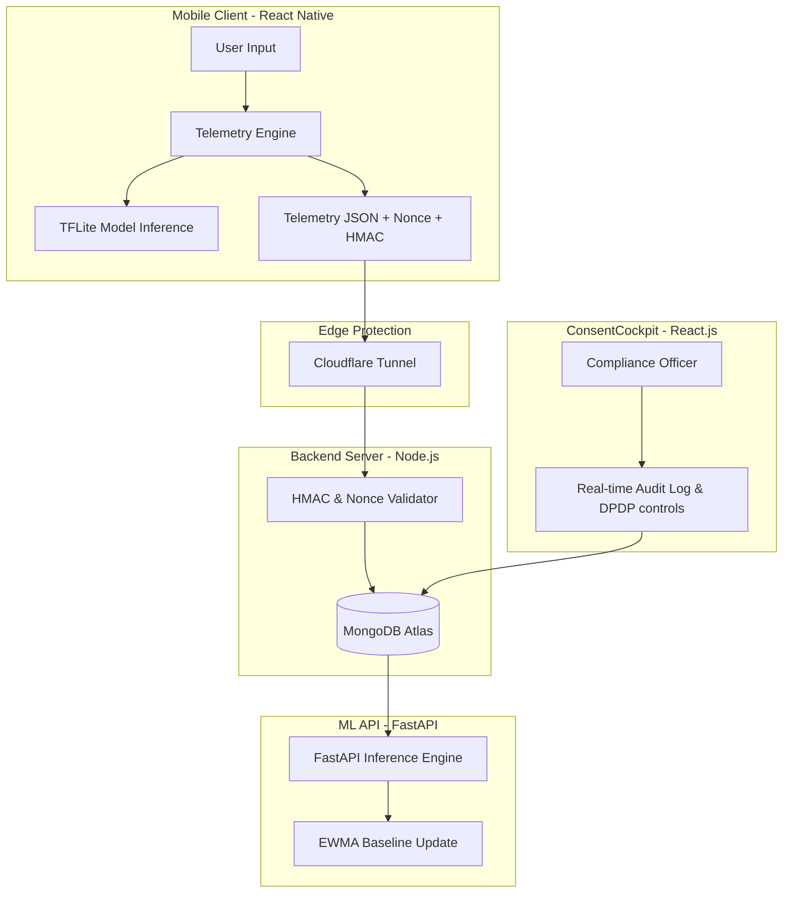
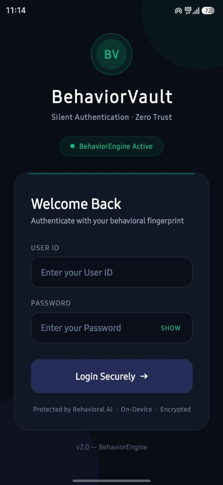
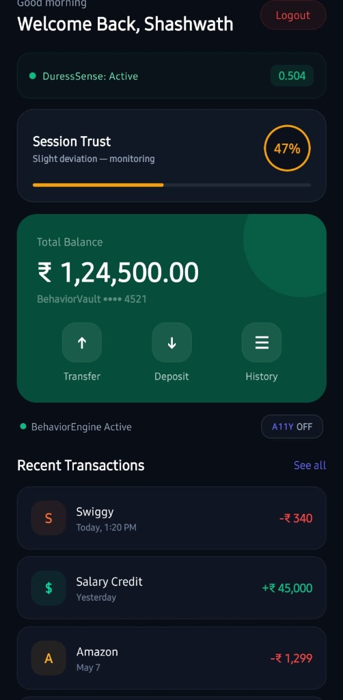
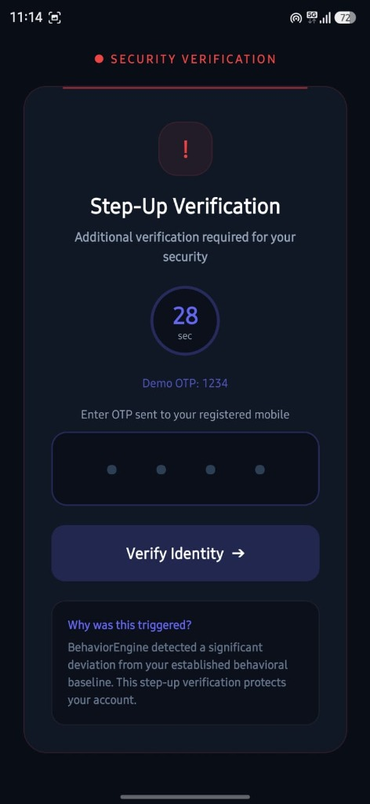
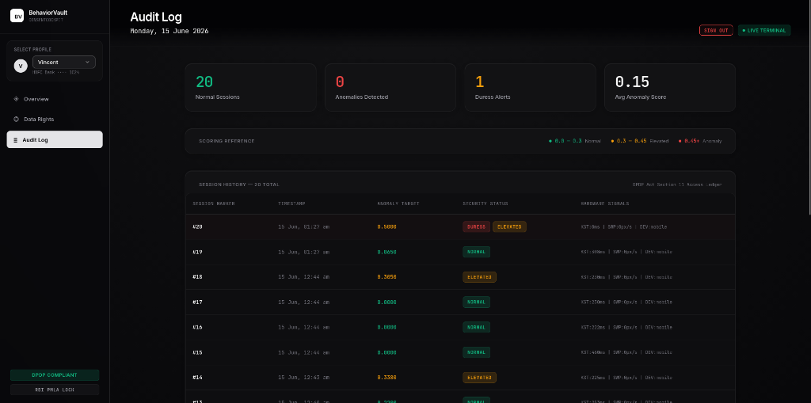
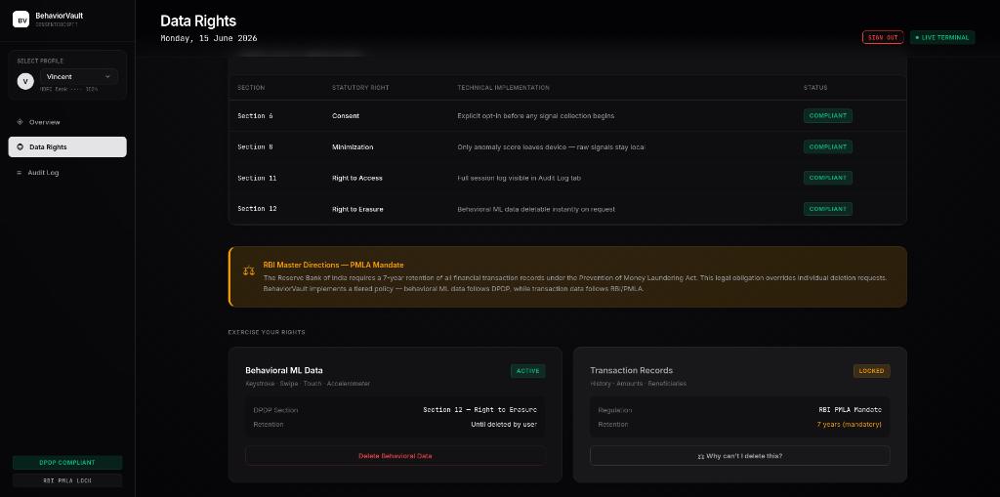

# 🔐 BehaviorVault 2.0
[](LICENSE)

> **Continuous Behavioral Authentication System for Mobile Banking**


BehaviorVault 2.0 is a next-generation security and compliance layer designed for mobile banking applications. By continuously measuring and scoring micro-interactions—typing rhythm, swipe speed, scroll patterns, touch pressure, and accelerometer variance—it verifies user identity throughout the active session, detecting credential sharing, coerced transactions, and automated bot attacks in real time.

---

## 🚀 Key Features

### 🚨 DuressSense (Shadow Escrow Protocol)
If a user is physically forced to make a transaction, their hand tremors are captured via the device accelerometer. When duress is detected, the app silently triggers a **Shadow Escrow**:
* The UI displays a realistic **"Transaction Successful"** screen so the attacker is unaware.
* The money is not transferred, and the backend puts the funds into a temporary escrow lock.
* A silent emergency alert is raised in the **ConsentCockpit** admin panel.

### 🤖 Bot & ADB Attack Detection
Automated inputs (such as ADB injections or script-driven touches) are flagged instantaneously. The system tracks the standard deviation of keystroke delays; automated inputs typically exhibit a standard deviation of $< 15\text{ ms}$, whereas human typing is naturally variable.

### 🧠 EWMA Adaptive Baseline
User behavior changes over time due to posture, environment, or tiredness. Rather than using static thresholds, BehaviorVault employs an **Exponentially Weighted Moving Average (EWMA)** baseline ($\alpha = 0.15$) to adapt dynamically to the genuine user's evolution, using a 3-session warm-up phase.

### ⚖️ Dual Regulatory Compliance
Aligns competing regulatory requirements under one architecture:
* **DPDP Act 2023 Compliance:** Allows users to request data deletion/revocation (DPDP §12) for their behavioral logs at any time.
* **RBI PMLA Compliance:** Enforces a mandatory 7-year retention lock on core transaction ledger data.

### 🖥️ ConsentCockpit
A real-time administrator console for bank compliance officers featuring:
* Anomaly monitoring and live security alerts.
* Session audit trails with complete DPDP compliance request history.
* Granular controls to lock profiles or view session telemetry.

---

## 🛠️ Tech Stack & Architecture

### Mobile App (Client)
* **Framework:** React Native + Expo
* **Telemetry Engine:** Custom event capture hooks tracking five metrics (Keystroke intervals, touch size, swipe velocity, scroll offset, and 3-axis accelerometer data).
* **On-Device Inference:** TensorFlow Lite (TFLite) running a 3KB neural network.

### Backend Services
* **Core API:** Node.js + Express + MongoDB Atlas.
* **Security:** Payloads signed with **HMAC-SHA256** and validated using single-use nonces to eliminate replay attacks.
* **Inference API:** Python + FastAPI running Isolation Forest classification models.

### Infrastructure & Deployment
* **Admin Cockpit:** React.js hosted on Render.
* **Production API:** Deployed on Render.
* **ML API:** Self-hosted on a Linux homelab, auto-deployed via Coolify, and securely tunneled with Cloudflare Tunnels (no open ports or static IP required).

---

## 📊 System Architecture




---

## 📸 Visual Showcase

<div align="center">
  <h3>Mobile Application</h3>
  <table style="width: 100%;">
    <tr>
      <td width="33%"></td>
      <td width="33%"></td>
      <td width="33%"></td>
    </tr>
    <tr align="center">
      <td><b>Mobile Login Screen</b></td>
      <td><b>Adaptive Trust Home Screen</b></td>
      <td><b>Step-Up Verification (High Anomaly)</b></td>
    </tr>
  </table>

  <br/>
  <h3>ConsentCockpit Compliance Portal</h3>
  <table style="width: 100%;">
    <tr>
      <td width="50%"></td>
      <td width="50%"></td>
    </tr>
    <tr align="center">
      <td><b>Compliance Audit Log Ledger</b></td>
      <td><b>DPDP Act Data Rights Control Console</b></td>
    </tr>
  </table>
</div>

---

## 📱 Try the Application

### 📦 Android Standalone APK
Download the compiled APK directly to your device (no Expo required):
👉 **[Download Android APK v2.4](https://expo.dev/artifacts/eas/8gLYnWTD8aI9_smfvXoJ43BKz6pZEvlbXi40nTpARgE.apk)**

### 📱 iOS & Android via Expo Go
To run the live build on your iPhone or Android device via the public Expo tunnel:
1. Install **Expo Go** from the App/Play Store.
2. Scan the QR code below or open the tunnel link on your mobile browser:
   * **Tunnel Link:** `exp://nhxbmh0-shashank_1910-8081.exp.direct`


### 🖥️ Live Dashboard (ConsentCockpit)
Access the live admin console at:
🔗 **[https://cockpitbv.onrender.com](https://cockpitbv.onrender.com)**

---

## 👥 Setup & Local Installation

### Prerequisites
* Node.js v18+
* MongoDB local instance or MongoDB Atlas Connection URI
* Expo Go app on a test device

### 1. Backend Setup
1. Navigate to the backend directory:
   ```bash
   cd behaviorvault-backend
   ```
2. Install dependencies:
   ```bash
   npm install
   ```
3. Create a `.env` file containing:
   ```env
   PORT=5000
   MONGO_URI=your_mongodb_connection_string
   HMAC_SECRET=your_hmac_secret_key
   ```
4. Start the server:
   ```bash
   npm start
   ```

### 2. Mobile App Setup
1. From the project root:
   ```bash
   npm install
   ```
2. Start the Expo development server:
   ```bash
   npx expo start
   ```
3. Scan the QR code printed in the terminal with your phone!

---

## 🛠️ Collaborators & Authors
Built with code and care by:
* **Shashwath V** ([@shashwathv](https://github.com/shashwathv))
* **Shashank G Yaplar** ([@Shashankgyaplar](https://github.com/Shashankgyaplar))
* **Shashank S** ([@shashanks](https://github.com/shashanks))

---

## 📄 License
This project is licensed under the MIT License - see the [LICENSE](LICENSE) file for details.

